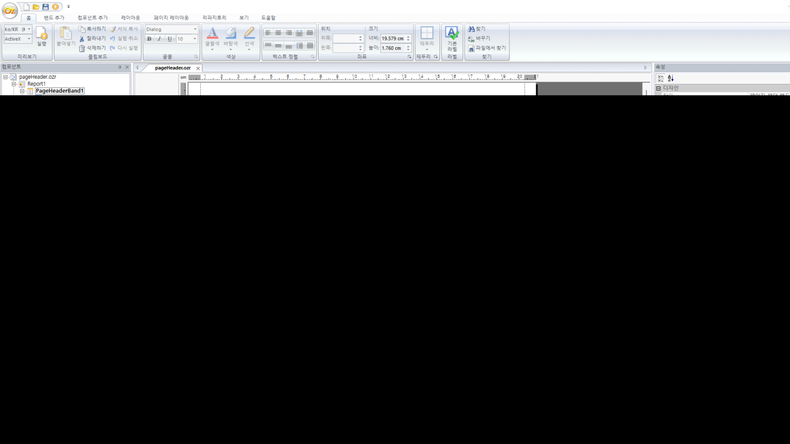

# 특정 페이지 숨기기

var ReportSeq = This.GetDataSetValue("DataBlock1.ReportSeq");

if(ReportSeq==2){

  This.SetEnable(false);

}

 

var page = This.GetDataSetValue("OZSystem.Page_Number");

if(page==2 \|\| page==3 \|\| page==4){

> This.SetEnable(false);

}

 

\<\<pageHeader.ozr\>\>

 

 

