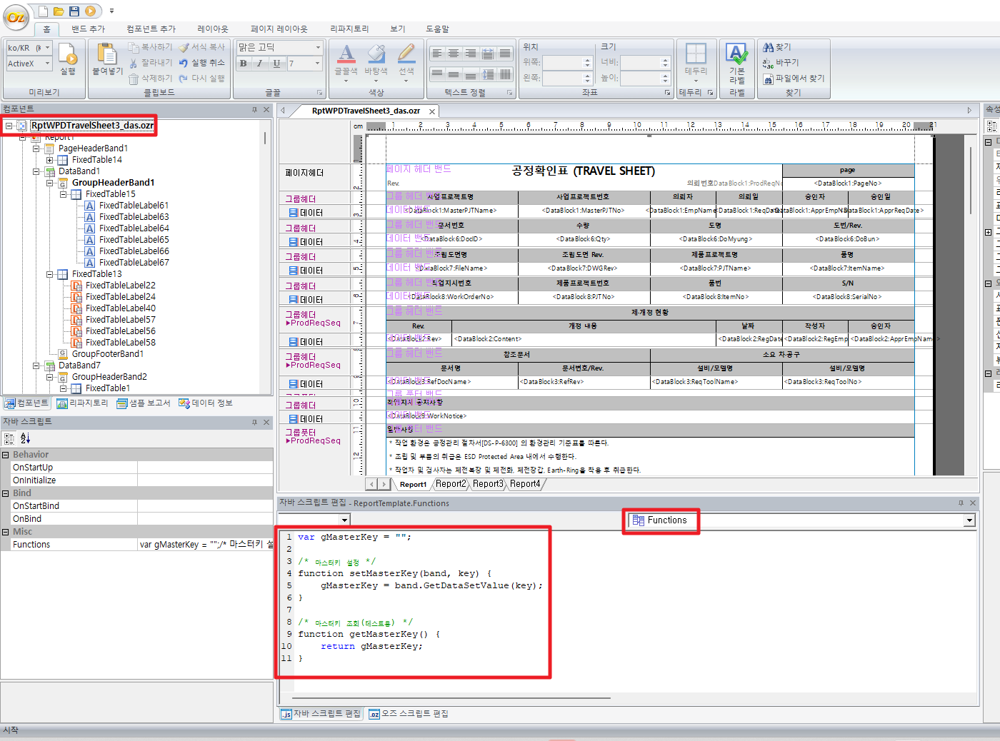

# 출력물 변수 set, get 함수 설정

var gMasterKey = "";

 

/\* 마스터키 설정 \*/

function setMasterKey(band, key) {

> gMasterKey = band.GetDataSetValue(key);

}

 

/\* 마스터키 조회(테스트용) \*/

function getMasterKey() {

> return gMasterKey;

}

 

