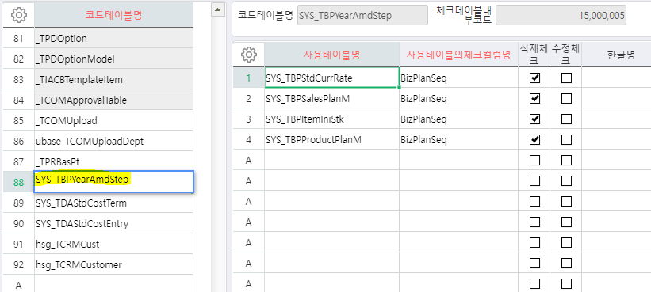

# 코드삭제시 사용여부체크

 

 

- 체크 sp에 작성

IF EXISTS (SELECT 1 FROM \#BIZ_OUT_DataBlock1 WHERE WorkingTag = 'D')

BEGIN

EXEC \_SWCOMCodeDeleteCheck @CompanySeq, @UserSeq, @LanguageSeq, 'SYS_TBPYearAmdStep', '#BIZ_OUT_DataBlock1', 'BizPlanSeq'

END

 

 

 

-- 제뉴인

EXEC dbo.\_SCOMCodeDeleteCheck @CompanySeq,@UserSeq,@LanguageSeq,'hkcon_TSLOption', '#BIZ_OUT_DataBlock1','UMItemClassS'